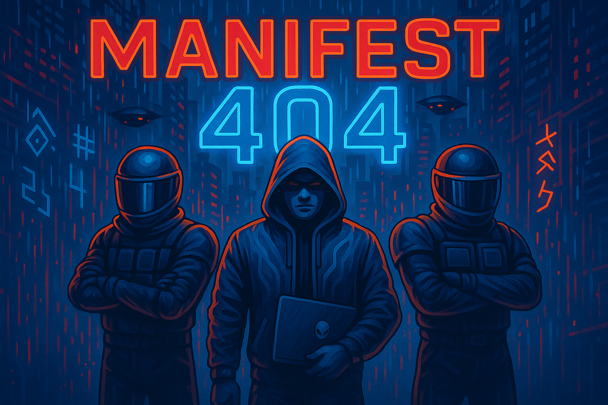

# 📀 Manifest 404

**Manifest 404** is an experimental digital punk rock project that merges  
the raw intensity of hardcore riffs with the aesthetics of cyberpunk culture.  
Composed and produced with the assistance of AI, this album explores themes of  
control, rebellion, irony, addiction, and liberation in a hyper-connected world.

---

## 🎶 Tracklist

1. **Algorithmic Tyranny**  
   A heavy opener that confronts the invisible power of algorithms shaping modern life.  
   Freedom reduced to data points, choice swallowed by prediction.

2. **Code Revolution**  
   Punk energy turned into digital rebellion.  
   Armed with code, coffee, and distorted guitars — the anthem of those who fight back.

3. **Pixelated Love**  
   An ironic ballad about intimacy lost in the noise of screens and glitches.  
   Affection reduced to pixels, relationships filtered through firewalls.

4. **Synthetic Addiction**  
   A dark track reflecting modern dependencies: dopamine, notifications, artificial pleasures.  
   Fast, abrasive, and suffocating — the sound of being consumed by plastic highs.

5. **Break the Firewall**  
   The title track — raw defiance and catharsis.  
   Chains shatter, voices rise, and walls collapse in a collective scream for liberation.

---

## 🔥 Concept

_Break the Firewall_ is made with this flow in mind:

**Control → Revolt → Irony → Addiction → Liberation**

The project reimagines punk rock for the 21st century.

---

## 🛠️ Technology & Process

This album was created using **AI-assisted music generation** free, combined with  
manual prompts and few sound design. The result is a hybrid of machine-driven ideas  
and human direction.

- **Tools Used:** AI music generation and sound design plugins.
- **Code & Visualization:** React, TypeScript, Framer Motion, TailwindCSS, Web Audio API.

---

## 🎸 Credits

Produced & Directed by **Milton Rodrigues**  
_Software Engineer & Punk Rock AI Producer_

---

⚡ \_Manifest 404 is not a traditional band.
