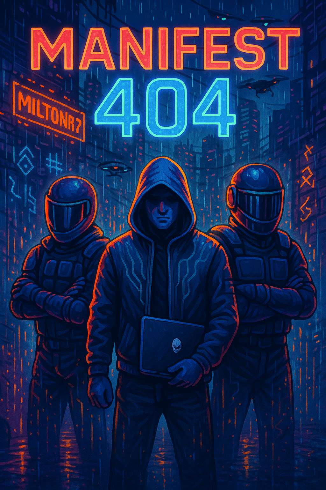

# 📀 Manifest 404 MP3 Player

**Manifest 404** is a digital punk-rock experiment that fuses  
hardcore riffs, AI-driven creativity, and cyberpunk aesthetics.  
Each song reflects a modern rebellion — a scream inside a machine-wired world.

---

## 🎧 Sound Experience

The custom **MP3 Player** is the core of Manifest 404’s interactive experience.  
Built entirely in **React + TypeScript**, it delivers album-grade sound and motion in the browser.

### ✨ Features

- **Dynamic playlists** for each album (e.g., _Firewall_, _Saints_, etc.)
- **MiniPlayer** that appears when the main panel scrolls out of view
- **Framer Motion transitions** for smooth, hardware-accelerated animations
- **Custom hooks** for playback, progress tracking, and visibility detection
- **Responsive layout** optimized for desktop and mobile
- **Visual hierarchy** that highlights track metadata and artwork dynamically

The goal was to make the listening experience feel like part of the Manifest 404 narrative —  
every scroll, fade, and glitch moves in rhythm with the songs.

---

## 🛠️ Tech Stack & Decisions

Manifest 404 is a fusion of **music + frontend engineering**, pushing both into expressive art.

| Area          | Technology                | Reason                                                             |
| ------------- | ------------------------- | ------------------------------------------------------------------ |
| Framework     | **React 18 + TypeScript** | Strict typing and modular component structure                      |
| Styling       | **TailwindCSS**           | Utility-first styling for rapid prototyping and visual consistency |
| Animation     | **Framer Motion**         | Fluid transitions, spring-based physics, and micro-interactions    |
| Audio Engine  | **React H5 Audio**        | Custom playback controls with real-time timing sync                |
| MP3 Storage   | **Supabase**              | Audio files are hosted in scalable cloud and streamed via CDNs     |
| Icons         | **Lucide-React**          | Minimalist SVG icons for visual rhythm                             |
| State         | **React Hooks**           | Simplicity over heavy global stores; easy track state management   |
| Design System | Custom HSL palette        | Cyberpunk-inspired gradients, tuned for light/dark balance         |

### 🧩 Architectural Decisions

- **Component isolation:** each album, playlist, and modal is modular.
- **Dynamic height detection:** ensures the player adapts to the viewport and MiniPlayer offset.
- **IntersectionObserver:** powers smooth transitions between playback modes.
- **Progressive rendering:** artwork and banners load with priority over secondary assets.

The code still needs to be refactored to receive tests

---

## 🎸 Credits

Produced & Directed by **Milton Rodrigues**  
_Software Engineer // Punk-Rock AI Producer_

---

⚡ Manifest 404 isn’t just a band —  
it’s **made for FUN!**
